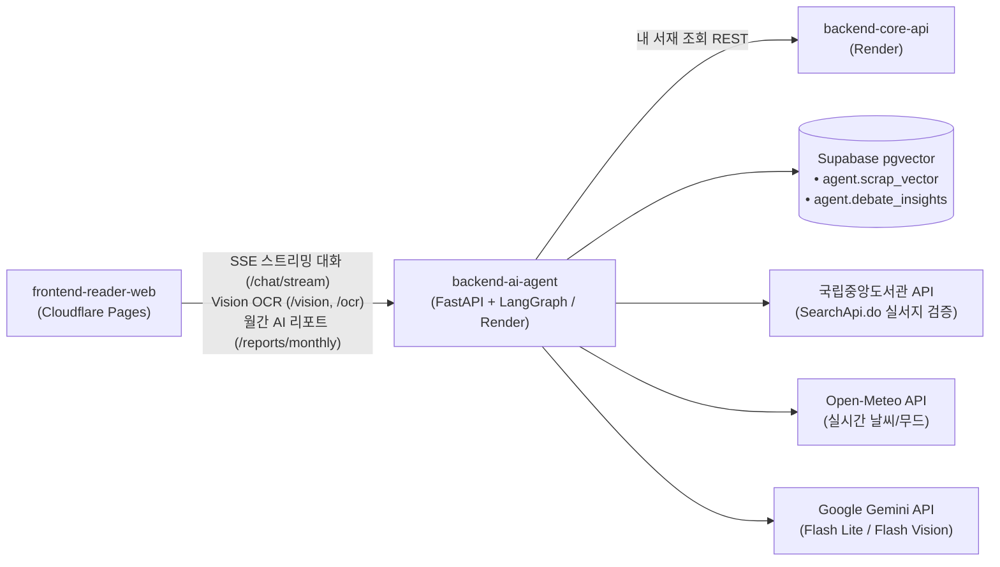

# backend-ai-agent 🐾📚

> **DPYB (Don't Paw-get Your Book) AI 사서 & 독서 토론 RAG 마이크로서비스**  
> 4종 동물 사서 추천 대화, 4인 전문 파트너 심층 독서 토론(3단계 플로우), LangGraph 8-Node 어조 오염 방지 워크플로우, 국립중앙도서관 실서지 검증 도서 큐레이터, Gemini Flash Vision OCR 및 Supabase pgvector 기반 개인화 메모 회상 RAG를 전담하는 지능형 에이전트 서비스입니다.

---

## 🏛️ 아키텍처 개요



---

## 💡 핵심 아키텍처 및 2-Track 모드 (8개 페르소나)

LangGraph 기반의 `StateGraph` 워크플로우를 통해 단일 챗봇 안에서 **사서 모드**와 **토론 모드**의 2-Track 경험을 유기적으로 제공합니다.

### 1. 📚 사서 모드 (`LIBRARIAN`)
사용자의 서재 관리, 기분·날씨 공감, 실존 도서 맞춤 추천을 전담하는 동물 사서 4종:
1. **고양이 사서 (`CAT`)**: 기본 표시명 **'블루'** (차분하고 지적인 평론가 어조, 깊이 있는 통찰)
2. **넓적부리황새 사서 (`SHOEBILL`)**: 기본 표시명 **'슈빌'** (흡입력 있고 에너지 넘치는 1타 강사 어조, 요약과 동기부여)
3. **바다달팽이 사서 (`SEA_SLUG`)**: 기본 표시명 **'누디'** (깊은 바닷속 고요함, 몽환적인 심해 힐링 어조)
4. **게코 도마뱀 사서 (`GECKO`)**: 기본 표시명 **'게코'** (책장 벽과 구석구석을 누비며 숨겨진 보물을 찾는 위트 넘치는 호기심 탐구 어조)

> **사용자 지정 사서 애칭**: 사용자가 설정한 사서 이름(`librarian_name`)이 있을 경우, 기본 표시명 대신 애칭을 스스로 부르며 대화합니다.

### 2. 🎙️ 토론 모드 (`DEBATE`) — 3단계 플로우 & 4인 전문 파트너
책의 주제, 인물의 선택, 딜레마에 대해 깊이 있는 문해력 독서 토론을 나누는 파트너:
1. **평론가 (`DEBATE_CRITIC`)**: 미학적 구조, 복선과 은유 분석, 영화적 통찰 (이동진 오마주)
2. **이야기꾼 (`DEBATE_STORYTELLER`)**: 극적 서사 전개, 역사적 맥락과 생생한 몰입감 유도 (설민석 오마주)
3. **상담사 (`DEBATE_COUNSELOR`)**: 인물의 심리 메커니즘 분석, 상처와 공감, 내면 치유 (오은영 오마주)
4. **관찰가 (`DEBATE_OBSERVER`)**: 본능과 환경의 상호작용, 현실 직시 및 행동 관찰 (강형욱 오마주)
- **종료 피날레 (`action: 'conclude'`)**: 토론 종료 시 통찰 총평을 제시하고, 논제와 연계된 맞춤 추천 도서를 선별하여 서재 등록 카드(`curated_books`)로 제공하며, 토론 통찰은 `agent.debate_insights` 벡터 테이블에 자동 영속화됩니다.

### 3. 🛡️ 페르소나 오염 방지 & 도서 큐레이터
- **`summarizer_node`**: 페르소나 간 전환(Handoff) 시 이전 발화자의 고유 말투를 제거하고 **사용자의 질문과 객관적 독서 팩트만 압축**하여 다음 페르소나에게 전달.
- **`curator_node` (환각 방지 3단계 서지 파이프라인)**:
  - 1단계: 사용자 상황/감정에 대한 사색 및 공감
  - 2단계: 맞춤 도서 선정 및 추천 사유 제시
  - 3단계: 국립중앙도서관 실서지 API(`search_book`) 교차 검증을 통해 13자리 ISBN, 교보문고 고화질 CDN 표지, 실제 쪽수, 정식 출판사가 보증된 실존 도서만 프론트엔드 등록 카드로 바인딩.

### 4. 👁️ 무상태 Vision & OCR 파이프라인
- **Gemini Flash Vision OCR**: 유료 Clova OCR 의존성을 제거하고 무과금 Google AI Studio 쿼터를 활용해 책 표지 바코드(ISBN-13), 5자리 KDC 부가기호 및 책 문장 스크랩 텍스트를 줄바꿈 손상 없이 정밀 추출.
- **스마트 포커스 크롭 연동**: 프론트엔드 크롭 모달에서 전송한 선택 영역 박스(`crop_box`)를 기반으로 필요한 문장 영역만 서버 사이드 정밀 추출.

---

## 🛠️ 기술 스택

| 구분 | 사용 기술 |
|---|---|
| **언어 & 프레임워크** | Python 3.12, FastAPI, Pydantic v2 |
| **에이전트 오케스트레이션** | LangGraph (8-Node StateGraph, Dynamic Routing) |
| **LLM & Vision** | Google Gemini (3.5 Flash Lite, 3.1 Flash Lite Vision), OpenAI (gpt-4o-mini 예비 폴백) |
| **임베딩 & 벡터 DB** | Google Gemini Embedding (`text-embedding-004`, 768차원), Supabase pgvector (HNSW Index) |
| **세션 & 캐싱** | Redis (대화 히스토리 슬라이딩 윈도우, RPD/RPM 서킷 브레이커, Yes24 신간 캐시) |
| **인프라 & 배포** | Render Web Service (Dockerfile 동적 `$PORT` 바인딩) |
| **코드 품질 & 테스트** | Ruff, Mypy, Pytest (212개 단위 테스트 100% Pass) |

---

## 📂 프로젝트 구조

```text
backend-ai-agent/
├── app/
│   ├── main.py                     # FastAPI 진입점, CORS, 듀얼 로깅, 수명주기 관리
│   ├── core/                       # 환경설정(config.py), 요청 컨텍스트 토큰 릴레이
│   ├── domain/
│   │   ├── personas/               # 사서 4종 및 토론 4인 페르소나 정의
│   │   ├── memory/                 # pgvector RAG 도구 (scrap_vector, my_library_tool)
│   │   ├── guardrails/             # Pre/Post-LLM 서비스 가드레일 (Safety, Security)
│   │   ├── tools/                  # Tavily 신간 탐색, 국립도서관 연동 도구
│   │   └── graph/                  # LangGraph 상태, 노드, 큐레이터, 워크플로우 그래프
│   ├── infrastructure/             # Redis 세션 매니저, Supabase 클라이언트, 국립도서관 API, Open-Meteo
│   ├── vision/                     # Gemini Flash Vision 바코드/문장 OCR 클라이언트
│   └── api/                        # 엔드포인트 라우터
│       ├── router.py               # /chat, /chat/stream, /personas, /health
│       ├── v1/vision.py            # /vision/scan-barcode, /vision/ocr (바코드 및 표지 OCR)
│       ├── v1/memory.py            # /memory/scraps (스크랩 벡터화 수신)
│       └── v1/reports.py           # /reports/monthly (AI 월간 리포트 및 독서가 유형 생성)
├── alembic/                        # agent 스키마 pgvector 마이그레이션 버전 관리
├── tests/                          # 212개 단위 테스트 스위트
├── Dockerfile                      # uv 기반 경량 컨테이너
└── README.md
```

---

## 📋 핵심 API 엔드포인트 요약

| 도메인 | 메서드 | 경로 | 설명 |
| :--- | :--- | :--- | :--- |
| **시스템** | `GET` | `/health` | 서비스 헬스체크 (Redis, Supabase 연결 확인) |
| **사서 & 페르소나** | `GET` | `/api/v1/personas` | 사서 4종 및 토론 파트너 4인 목록 조회 |
| **실시간 대화** | `POST` | `/api/v1/chat` | 사서/토론 일반 대화 (단일 JSON 응답) |
| | `POST` | `/api/v1/chat/stream` | **SSE 실시간 스트리밍 대화** (`token`, `books`, `metadata`, `done`) |
| **비전 & OCR** | `POST` | `/api/v1/vision/scan-barcode` | 13자리 도서 바코드(ISBN) 스캔 및 5자리 KDC 추출 |
| | `POST` | `/api/v1/ocr/sentences` | 문장 수집 크롭 이미지 텍스트 정밀 추출 |
| **개인화 RAG** | `POST` | `/api/v1/memory/scraps` | 사용자 독서 문장/메모 768차원 벡터 임베딩 및 적재 |
| **월간 AI 리포트** | `POST` | `/api/v1/reports/monthly` | 사용자의 한 달 독서 기록 기반 AI 독서가 유형 및 분석 생성 |

---

## 🚀 로컬 개발 및 테스트

```bash
# 1. 의존성 설치 (uv)
uv sync

# 2. 코드 스타일 및 정적 타입 검사
uv run ruff check .
uv run mypy app

# 3. agent 스키마 DB 마이그레이션 적용 (Alembic)
uv run alembic upgrade head

# 4. 단위 테스트 실행 (212개 테스트)
uv run pytest tests/unit -v

# 5. 로컬 개발 서버 실행
uv run uvicorn app.main:app --reload --port 8000
```